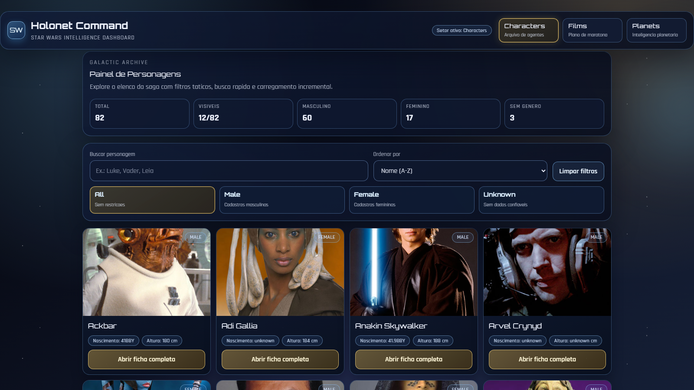
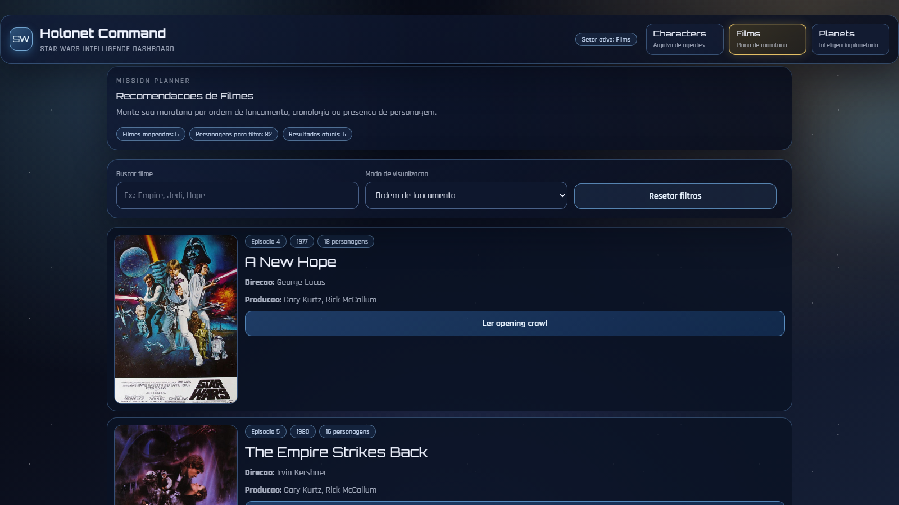
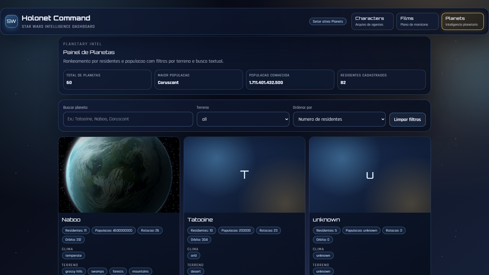

# Star Wars Holonet

Aplicacao Angular que consome a SWAPI para explorar personagens, filmes e planetas em uma interface Star Wars.

## Status da documentacao

A documentacao deste repositorio esta alinhada com o estado atual do codigo em 28/02/2026.

## Principais funcionalidades

- Personagens:
  - busca por nome;
  - filtro por genero;
  - ordenacao por nome, nascimento, altura e massa;
  - infinite scroll por lotes;
  - modal com dados relacionados (filmes, especies, veiculos, naves e planeta natal).
- Filmes:
  - filtros por ordem de lancamento, ordem cronologica e por personagem;
  - busca por titulo;
  - leitura de opening crawl por item.
- Planetas:
  - busca textual;
  - filtro por terreno;
  - ordenacao por residentes, populacao e nome;
  - metricas agregadas no topo da pagina.

## Imagens com SWAPI

A SWAPI nao fornece imagens nativamente. O projeto resolve isso com fallback em cadeia:

1. `jsdelivr` (star-wars-guide)
2. `raw.githubusercontent` (star-wars-guide)
3. `starwars-visualguide`
4. placeholder local de UI quando todas as URLs falham

Detalhes tecnicos completos: `docs/SWAPI_AND_MEDIA.md`.

## Performance

- cache de payload final por chave;
- deduplicacao de requests em voo com `shareReplay(1)`;
- cache de nomes de recursos relacionados;
- filtros/ordenacao locais apos carga;
- `loading="lazy"` para imagens;
- renderizacao incremental da lista de personagens.

Detalhes tecnicos completos: `docs/PERFORMANCE.md`.

## Screenshots

Preview rapido:

**Characters**



**Films**



**Planets**



## Stack

- Angular 18
- TypeScript
- Tailwind CSS 3
- SCSS
- RxJS
- SWAPI

## Estrutura de pastas

- `src/app/core/models`: interfaces de dados
- `src/app/core/services`: consumo de API, cache e regras de negocio
- `src/app/shared/components`: componentes compartilhados
- `src/app/feautures/characters`: pagina de personagens
- `src/app/feautures/films`: pagina de filmes
- `src/app/feautures/planets`: pagina de planetas
- `docs`: documentacao tecnica do projeto

## Rotas

- `/characters`
- `/films`
- `/planets`

A rota raiz (`/`) redireciona para `/characters`.

## Instalacao e execucao

```bash
git clone https://github.com/WillianIsami/StarWarsApp.git
cd StarWarsApp
npm install
npm start
```

Aplicacao local: `http://localhost:4200`

## Scripts

```bash
npm start      # servidor de desenvolvimento
npm run build  # build de producao
npm run watch  # build em watch (development)
npm test       # testes unitarios
```

## Documentacao tecnica

- [Arquitetura](docs/ARCHITECTURE.md)
- [SWAPI e Midia](docs/SWAPI_AND_MEDIA.md)
- [Performance](docs/PERFORMANCE.md)
